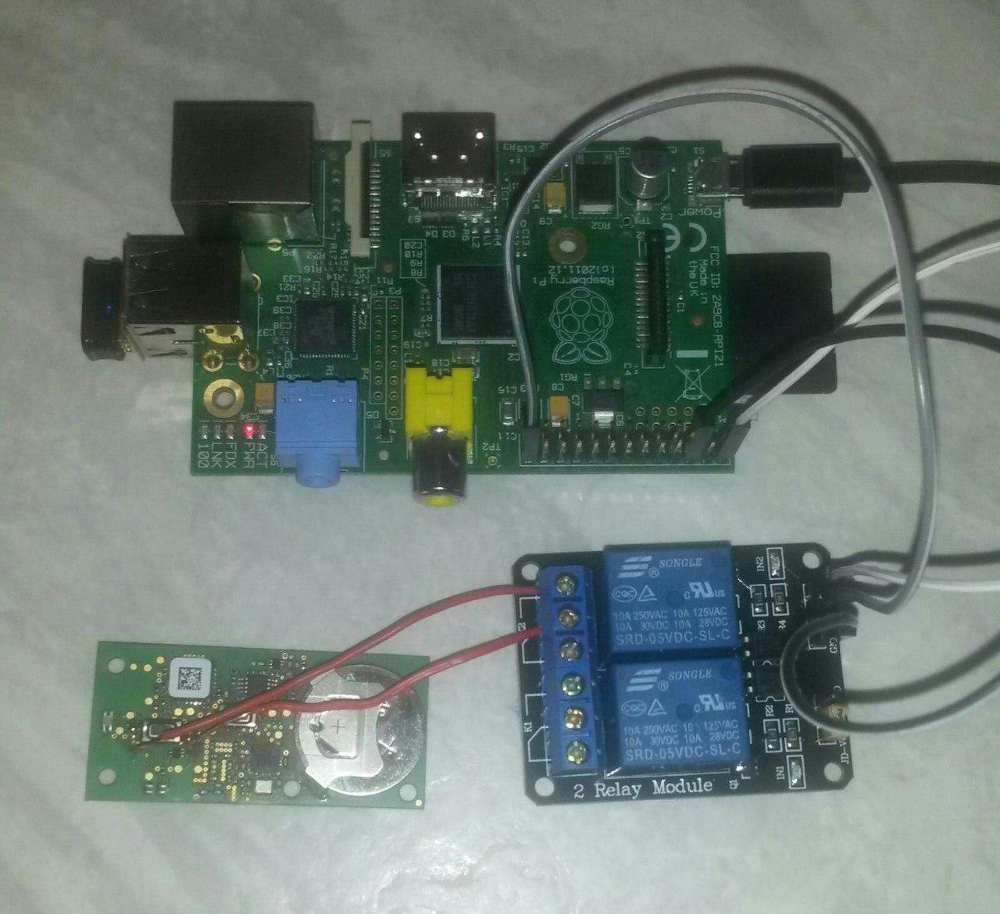
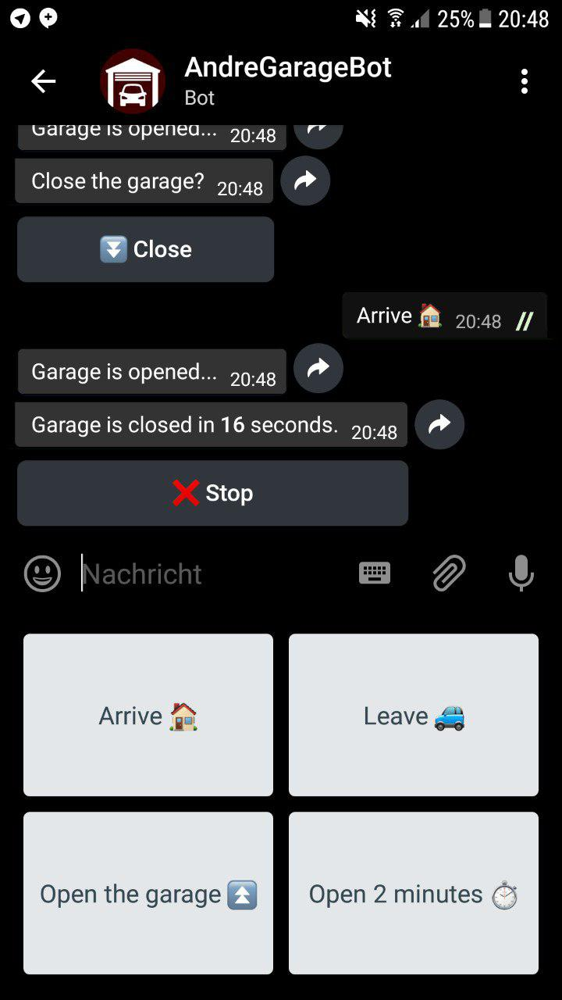

# GarageBot

#### This telegram bot is used to switch a relay, which controls a remote control of a garage.

## Functions:

- Allows easy switching or opening for a period of time
- Can close the garage after arriving or leaving
- Determines the presence by pinging the owner's smartphone in WiFi
- Warns before closing and allows a break-off
- Allows usage via Telegram only for specific users
- Notifies the owner about the use of the bot by other registered users


## Project Setup

I have soldered two wires to the switch of the garage remote to bridged it. Then the wires were connected to a relay. This relay is controlled by a Raspberry Pi.




## Installation
For installation on a Raspberry Pi:
```
git clone https://github.com/Andre0512/GarageBot
cd GarageBot
sudo pip3 install python-telegram-bot
sudo pip3 install pyyaml
```
#### Rename the string file in your language to `strings.yml`
```
cp strings.yml.english strings.yml
```
#### Enter required data into `config.yml`
```
cp config.yml.default config.yml
```
For this step, you have to register a Telegram bot by the Telegram [@BotFahter](https://t.me/botfather).

You can see the Telegram IDs by using an alternative Telegram Client like [Plus Messenger](https://play.google.com/store/apps/details?id=org.telegram.plus) for Android or using the [@userinfobot](https://telegram.me/userinfobot)

#### Start
```
python3 garage.py &
```


## Screenshot of the Bot
The finished bot looks like this:


